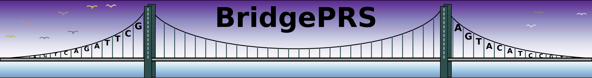

BridgePRS is a trans-ancestry PRS software which improves polygenic risk score analysis in diverse populations.

1. Calculating PRS using Ridge Regression
2. Porting a PRS model from one population to another
3. Using European data as a prior to improve PRS in diverse populations
4. Results plotted in several formats

# Background

You will need to have basic understanding of Genome Wide Association Studies (GWAS) and polygenic scoring (PRS) to be able to use BridgePRS. 
If you are unfamiliar with GWAS, you can consider reading [this paper](https://www.ncbi.nlm.nih.gov/pubmed/29484742).  If you have familiarity 
but need a crash refresher then reading the following section will be helpful. 

## Single Population Analysis 

**GWAS** 

- Genome wide association studies (GWAS) involve analyzing the genomes of a larger group of individuals.  This involves looking screening 
millions of genetic variants (SNP) for association with a particular trait.  
- For a binary trait (like blue or brown eyes) this involves comparing the frequency of genetic variations in each group to produce an odds-ratio (measure of association) and a p-value to measure the 
signficance of the realtionship at each SNP. 
- For continuous measures (like height) this results in an effect size (measure of continuous association) and p-value that measure the significance of our relationship.   

- GWAS results can be summarized in a sumstats file which looks like this: 

|SNP|BP|REF|ALT|BETA|PV|NOTES
|:-:|:-:|:-:|:-:|:-:|:-:|:-:|
|rs3094315|10523|A|G|1.491|0.0029|Positive ($>1$) Trait Association|
|rs3131972|91345|A|G|0.817|0.0008|Negative ($<1$) Trait Association|
|rs3131971|23040|T|C|1.001|0.5332|Insignificant ($PV>0.05$) Association|

**PRS**

- Creating individual polygenic scores involves combine information across many genetic variants.  A score is calculated summing the genetic association values (beta-weights) 
for each allele in an individual.  This means that variants with stronger associations have a larger impact on the overall score.  
- Usually, variant selection and assignment of SNP weights are determined using a very large "test dataset" of individual genotypes and phenotypes and 
then validated on an out of sample dataset of genotypes and phenotypes. 
- The correlation between the out of sample inidividual phenotypes and their predicted values (PRS scores) can be measured ($R^2$) to assess how predictive the PRS model is. 

## Cross Population Analysis 

**The PRS Portability Problem**

- Often when PRS results from a large test population (usually of European ancestry) are validated to an out of sample population of different ancestry the PRS model is not predictive.  
- Unfortunately, there is not enough data in the non-european population to produce a reliabile "test dataset" so researchers have to either accept either: 
    - An underpowered PRS model made using only the non-european population. 
    - A large PRS model based on European test data that doesn't perform well. 

**The BridgePRS Solution**

- BridgePRS solves this problem by first running producing three different PRS-models. 
    - PRS ran using only the target (Non-European) dataset  
    - PRS ran using SNP-weights calculated from the European Model 
    - PRS ran using a prior effect-size distribution from the European Model  
- Then BridgePRS combines these results to produce a weighted PRS solution. 

