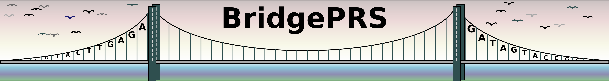

 

# Subprograms 

BridgePRS consists of five related multi-function subprograms: 78

1) **BridgePRS prs-single**  
2) **BridgePRS build-model**  
3) **BridgePRS prs-port**    
4) **BridgePRS prs-prior**   
5) **BridgePRS analyze combine**

|Subprogram|Input|Subcommands|Output|
|:-:|:-:|:-:|:-:|
|**prs-single**                 |Target Pop Data|**run**,clump,beta,predict,quantify|prs-result| 
|**build-model**|Model Pop Data|**run**clump,beta,predict,prior|model-params| 
|**prs-port**|Target Pop + Model Result|**run**,predict,quantify|prs-port-result| 
|**prs-prior**|Target Pop Data + Model Result|**run**,clump,beta,test,predict|prs-prior-result| 
|**analyze**|PRS Result Files|**run**result,combine|single-plot,weighted prs-result,weighted prs plot| 

These programs can be called consecutively using the easyrun master-program 
which will create the following directory structure: 

##prs-single 

The subprogram (**prs-single**) and subcommand (**run**) (`./bridgePRS prs-single run`) requires that the 
following target population data be provided on the command line or inside of a configuration file: 

1. **--pop:** The name of your target population 
2. **--ldpop:** The ld reference name, if different from target population name 
3. **--sumstats_prefix:** Sumstats data 
4. **--genotype_prefix:** Target Genotype Data 
5. **--phenotype_file:** Target Phenotype File 

This subprogram performs single population **RidgePRS**. 

##build-model

The subprogram is run on the base population (where the GWAS is larger). 

1. **--pop:** The name of your target population 
2. **--ldpop:** The ld reference name, if different from target population name 
3. **--sumstats_prefix:** Base sumstats data 
4. **--genotype_prefix:** Base Genotype Data (If available) 
5. **--phenotype_file:** Base Phenotype File  (If available) 

This program performs **RidgePRS** on the base population and then provides 
a prior distribution for each SNP weight that can be passed onto the next programs. 

##prs-port 

The subprogram uses the model result and the target population data to "port" the SNP 
weights from the base population to make estimates in the target population.  

##prs-prior 

The subprogram uses the model result and the target population data and uses the 
the SNP weights from the base population to estimate a prior distribution to 
make estimates in the target population.  

##analyze

The analyze subprogram is used to either make a plot from a single result (above) or 
to combine the results of all three. 

