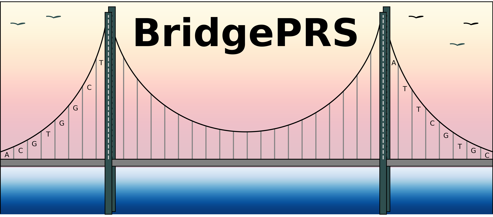

[//]: # ( 
[//]: # (
 

 

[//]: # ( 

BridgePRS is a Bayesian-ridge (Bridge) method that "bridges" the PRS between two populations of different ancestry, developed to 
tackle the "PRS Portability Problem".  The PRS portability problem causes lower PRS accuracy in target
populations which were not included in the GWAS summary statistics base populations used to estimate the PRS. This is because of differences in linkage disequilibrium
(LD), differences in allele frequency driven by genetic drift and
natural selection, and gene–environment interactions affecting causal
effect sizes between the base and target populations.

# Package Downloads 
| Operating System | Link | Notes | 
| -----------------|:----------:|:----:| 
| Linux  64-bit | [v1.0.2](https://github.com/clivehoggart/BridgePRS/archive/refs/heads/main.zip) | Updated 1-20-2024 |  
| Mac  64-bit   | [v1.0.2](https://github.com/clivehoggart/BridgePRS/archive/refs/heads/main.zip) | Updated 1-20-2024 | 
| Windows       | NA     | Not Available | 
| 1000G Ref Panel | [1000G_ref.tar.gz](https://drive.google.com/file/d/1djAEwRiQsh4veinSLHO3laGjNF95vvN9/view?usp=drive_link) | Optional (Unzip into data directory to use) |    

!!! Note "Latest Updates"
    # 2023-09-15 (v0.1.7)
    - We have added sample thousand genomes data. 
    - update log can be found [here](misc_log.md)

# Overview 

- BridgePRS is a software package written in R (main) and Python (wrapper) that depends on [Plink.](https://www.cog-genomics.org/software) 
  For more information on installing dependencies, please refer to [Requirements](req_software.md). 
- To get BridgePRS running using toy data see our [Quick Start Tutorial.](quikstart_data.md).
- Following the Quick Start, the full guide provides more [realistic examples](guide_challenges.md) to help you get started with your own data. 

!!! Warning "Citation: Our Manuscript is published in Nature Genetics" 
    Please cite our [paper](https://www.nature.com/articles/s41588-023-01583-9): 
 
    Hoggart C, Choi SW, García-González J, Souaiaia T, Preuss M, O'Reilly P. BridgePRS leverages shared genetic effects across ancestries to increase polygenic risk score portability. Nat Genet 56, 180–186 (2024).
    https://doi.org/10.1038/s41588-023-01583-9

## Contact 
For questions about the methodology, this website, or our manuscript please contact [Dr Clive Hoggart](http://www.pauloreilly.info/), 
[Dr Tade Souaiaia](http://www.pauloreilly.info/), or [Dr Paul O'Reilly](http://www.pauloreilly.info/).  For source code and coding 
issues please visit the bridgePRS github [here](https://github.com/clivehoggart/BridgePRS). 

## Acknowledgements

We would like to thank Brian Fulton-Howard for his feedback and help with testing. 

