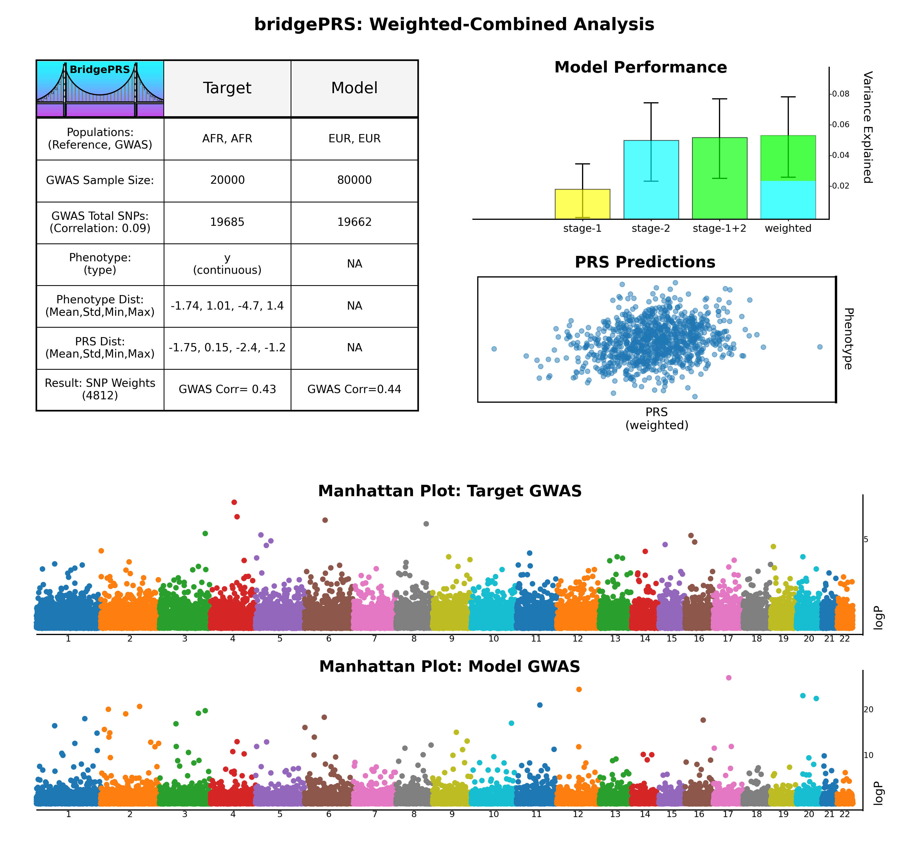

## Input Data 

This demo runs using the following population config files **data/pop_africa/afr.config** and **data/pop_europe/eur.config** that 
declare rudimentary options and point to the relative paths for all required population data. 

## Run The Demo: 

To run BridgePRS using a continuous phenotype: 

!!! tips "Easyrun Command: Continuous Trait (y)" 
     Run BridgePRS on the toy phenotype "y" with the following command: 
        ```
        ./bridgePRS easyrun go -o out1 --config_files data/afr.config data/eur.config --phenotype y 
        ```


And verify that a summary figure `out1/bridgeSummary.png` shown below is created.  Then repeat the 
process using a binary phenotype: 


!!! tips "Easyrun Command" 
    Run BridgePRS on the toy binary phenotype "y.binary" with the following command: 
        ```
        ./bridgePRS easyrun go -o out2 --config_files data/afr.config data/eur.config --phenotype y.binary
        ```

## Demo Results:


If bridgePRS runs successfully on the toy data, please go to the next page for information on interpretation of the results. 
Before running bridgePRS with larger real data, please consider reading our [most common use cases examples](guide_challenges.md) 
to understand how best to use bridgePRS in realistic scenarios. 

    



