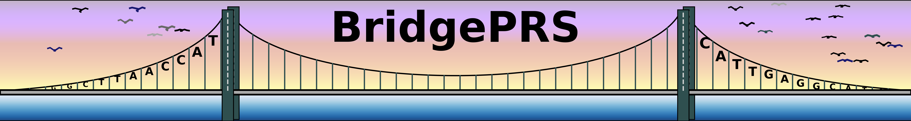

# Interpreting Results 

The easyrun command used in the previous step sequentially runs five different [subprograms](guide_subprograms.md) in 
output directory supplied on the command line (eg. **out1** and **out2**): 

1. `prs-single (stage 1):   ` [Run PRS using the target population only (AFR).](guide_subprograms.md#prs-single) 
2. `build-model:`     [Estimate SNP weights & prior params from model pop (EUR).](guide_subprograms.md#build-model)
3. `prs-port (stage 1.5):   `     [Run target-PRS using the model snp weights.](guide_subprograms.md#prs-port) 
4. `prs-prior (stage 2):`   [Run target-PRS using model prior distributions.](guide_subprograms.md#prs-prior)  
5. `analyze`          [Combine results to produce a weighted target PRS result.](guide_subprograms.md#prs-prior) 

And produces output in the following five subdirectories: 

1. **prs-single_AFR/quantify/:** Weights, predictions, and performance metrics. 
2. **model_EUR/prior:**          Model weights and priors. 
3. **prs-port_AFR/quantify/:**   Weights, predictions, and performance metrics. 
4. **prs-prior_AFR/quantify/:**  Weights, predictions, and performance metrics. 
5. **prs-combined_AFR/:**        Analysis that combined the previous four steps. 

The directory structure created by this command is shown below: 

