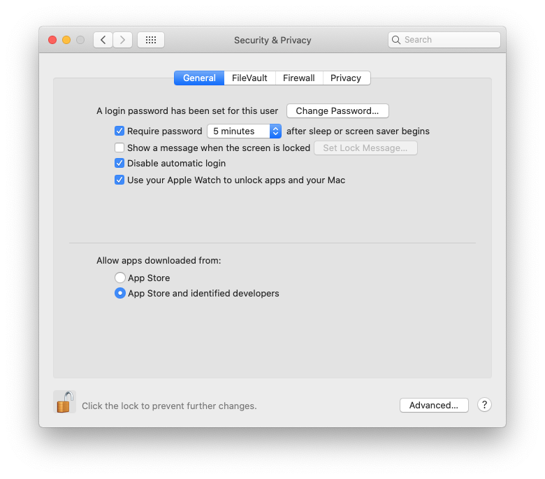

 


# Plink: Developer Cannot Be Verified 


If you see this error, **Do not click: Move To Trash**. 

Instead click on the top right hand corner of the box, or stop running BridgePRS and follow these instructions 
to give your system permission to call plink from BridgePRS:  

## 1- Default Settings
By default macOS allows you to open apps from the official Mac App Store only, If you have this set as your default 
you can change this if you: 
    
1. Open System Preferences.
2. Go to the Security & Privacy tab.
3. Click on the lock and enter your password.
4. Change settings to include identified developers (see below): 





## 2- Allowing Exceptions 


Expanding permissions to include "identified developers" is required but not sufficient.  To obtain 
further permission to run **Plink** or any other unapproved program you can:  


1. Open System Preferences.
2. Go to Security & Privacy and select the General tab.
3. If this has happened within the hour, this page will give you an override button to open **Open Anyway**. 
4. Enter you password as above and click this button.
5. You will be asked to once more which will create an exception allowing you to run Plink in the future. 


## 3- Downstream BridgePRS Errors


If you have moved plink to the trash you will have to recover it, additionally the empty 
files created by a failed attempt to run Plink can cause problems if BridgePRS tries to recover your progress. 


!!! tip "Restarting a bridgePRS run"
    You can avoid this problem by manually deleting your output directory and starting over, or by using the restart flag: 
        ```
        $./bridgePRS easyrun go -o out1 --pop_configs data/afr.config data/eur.config --phenotype y --restart
        ```
    This will force bridgePRS to restart every subprogram from the beginning.     


 
