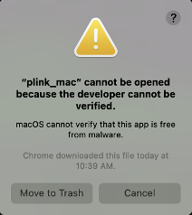

 

# Mac specific issues

Mac security will not initially allow plink to run and will flag this error



**Do not click: Move To Trash**. 

Instead click on the top right hand corner of the box, or stop running
BridgePRS and follow these instructions to give your system permission
to call plink from BridgePRS.  After doing so you should be aware that
if you have moved plink to the trash that you will have to recover it
and place it in it's original directory ("src/Python/Xtra").
Additionally, empty files created by a failed attempt to run plink can
cause problems if BridgePRS tries to recover your progress.

!!! help "Restarting a bridgePRS run"
    You can avoid this problem by manually deleting your output directory and starting over, or by using the restart flag: 
        ```
        $./bridgePRS pipeline go -o out1 --config_files data/afr.config data/eur.config --phenotype y --restart
        ```
    This will force bridgePRS to restart every subprogram from the beginning.     


## Changing System Permissions 

### 0- Shortcut Fix 

!!! warning "Shortcut: Users report that this shortcut can also be used to change program permissions:" 
 	1. User finder navigate to the file in question. 
	2. Right click on the icon and select **open**. 
	3. A warning will pop-up.  Click open and this program can be run in the future. 
	


## 1- Change System Settings (Allow Exceptions)
By default macOS allows you to open apps from the official Mac App Store only, If you have this set as your default 
you can change this by first: 
    
1. Opening System Preferences.
2. Going to the Security & Privacy tab.
3. Clicking on the lock and entering your password.
4. Changing settings to include identified developers (see below): 


After expanding permissions to include "identified developers" you can obtain 
further permission to run **Plink** or any other unapproved program by:  

1. Opening System Preferences.
2. Going to Security & Privacy and selecting the General tab.
3. If it happened recently, this page will give you an override button to **Open Anyway**. 
4. Enter your password as above and click this button.
5. You will be asked to once more which will create an exception allowing you to run Plink in the future. 


 
